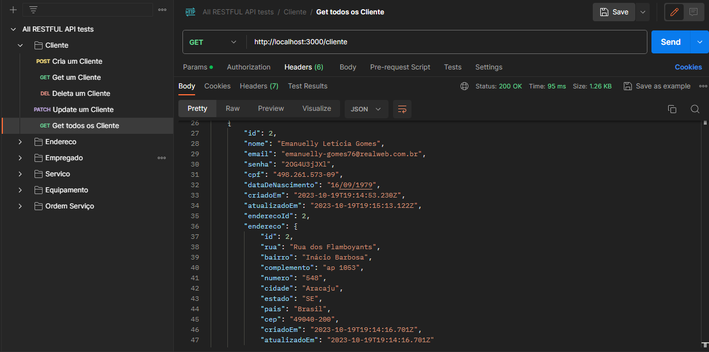
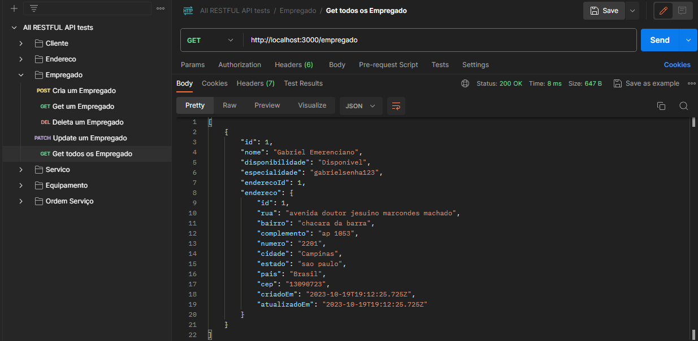

# Back-End do TCC Tech-Disk

<br>


-----
<br>

## RESTFUL API Feita com NESTJS e PRISMA
<br>

[](https://skillicons.dev)

<br>

------

<br>

## Sumário:
- ### [Instruções para rodar](#instruc3a7c3b5es-para-rodar-1)
- ### [Prints dos usos](#prints-dos-usos-1)
- ### [Estruturação do schema.prisma](#estruturac3a7c3a3o-do-schemaprisma-1)

<br>

----

<br>


## Instruções para rodar:
Primeiramente use no cmd:
```
npm i
```
e logo após:
```
npx prisma generate
```
e para executar o servidor:
```
npm run start:dev
```

<br>


----

<br>

## Prints dos usos: 

<div style="text-align: center;">

### Cliente:



<br>
<br>


### Empregado:



<br>
<br>


### Endereço:


<br>
<br>


### Equipamento:


<br>
<br>


### Ordem Serviço:


<br>
<br>


### Serviço:


<br>

----

<br>


</div>


## Estruturação do schema.prisma:

#### [Clique Aqui Para Ver o Arquivo Original.](prisma/schema.prisma)
```
// This is your Prisma schema file,
// learn more about it in the docs: https://pris.ly/d/prisma-schema

generator client {
  provider = "prisma-client-js"
}

datasource db {
  provider = "sqlite"
  url      = "file:../db.sqlite"
}

model Cliente{
  id                    Int   @id @default(autoincrement())
  nome                  String
  email                 String  @unique
  senha                 String
  cpf                   String
  dataDeNascimento      String
  criadoEm              DateTime @default(now())
  atualizadoEm          DateTime @updatedAt
  endereco              Endereco? @relation(fields: [enderecoId], references: [id])
  enderecoId            Int?
}

model Endereco{
  id                    Int   @id @default(autoincrement())
  rua                   String
  bairro                String
  complemento           String?
  numero                String
  cidade                String
  estado                String
  pais                  String
  cep                   String
  criadoEm              DateTime @default(now())
  atualizadoEm          DateTime @updatedAt
  cliente               Cliente[]
  empregado             Empregado[]
}

model Servico{
  id                    Int   @id @default(autoincrement())
  nome                  String
  garantia              String
  detalhesContrato      String
  recursos              String
  termosCondicoes       String
  objetivo              String
  requisitosCliente     String
  dataAgendada          String
  horaAgendada          String
  criadoEm              DateTime @default(now())
  atualizadoEm          DateTime @updatedAt
}

model Equipamento{
  id                    Int   @id @default(autoincrement())
  tipo                  String
  valor                 Float
  marca                 String
  modelo                String
  numeroSerie           Int
  criadoEm              DateTime @default(now())
  atualizadoEm          DateTime @updatedAt
}

model Empregado{
  id                    Int   @id @default(autoincrement())
  nome                  String
  disponibilidade       String
  especialidade         String
  endereco              Endereco? @relation(fields: [enderecoId], references: [id])
  enderecoId            Int?
}

model OrdemServico{
  id                    Int   @id @default(autoincrement())
  assinaturas           Int
  descricao             String
  orcamentos            String
  condicoes             String
  observacoesAdicionais String
  criadoEm              DateTime @default(now())
  atualizadoEm          DateTime @updatedAt
}
```